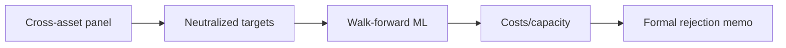

# Architecture

```mermaid
flowchart LR
    N0["Cross-asset panel"] --> N1["Neutralized targets"]
    N1["Neutralized targets"] --> N2["Walk-forward ML"]
    N2["Walk-forward ML"] --> N3["Costs/capacity"]
    N3["Costs/capacity"] --> N4["Formal rejection memo"]
    N4["Formal rejection memo"]
```

## Claim boundary

Real data and explicit modeled costs; final signal is rejected.
