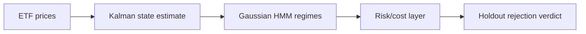

# Architecture

```mermaid
flowchart LR
    N0["ETF prices"] --> N1["Kalman state estimate"]
    N1["Kalman state estimate"] --> N2["Gaussian HMM regimes"]
    N2["Gaussian HMM regimes"] --> N3["Risk/cost layer"]
    N3["Risk/cost layer"] --> N4["Holdout rejection verdict"]
    N4["Holdout rejection verdict"]
```

## Claim boundary

Real public data with modeled costs; strategy is rejected against passive benchmark.
