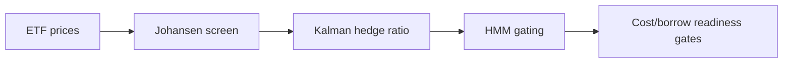

# Architecture

```mermaid
flowchart LR
    N0["ETF prices"] --> N1["Johansen screen"]
    N1["Johansen screen"] --> N2["Kalman hedge ratio"]
    N2["Kalman hedge ratio"] --> N3["HMM gating"]
    N3["HMM gating"] --> N4["Cost/borrow readiness gates"]
    N4["Cost/borrow readiness gates"]
```

## Claim boundary

Real public data; costs, borrow constraints and execution are modeled.
