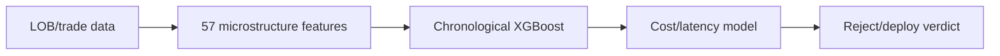

# Architecture

```mermaid
flowchart LR
    N0["LOB/trade data"] --> N1["57 microstructure features"]
    N1["57 microstructure features"] --> N2["Chronological XGBoost"]
    N2["Chronological XGBoost"] --> N3["Cost/latency model"]
    N3["Cost/latency model"] --> N4["Reject/deploy verdict"]
    N4["Reject/deploy verdict"]
```

## Claim boundary

Real data and live snapshots; execution and post-cost fills remain modeled.
