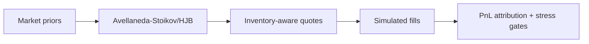

# Architecture

```mermaid
flowchart LR
    N0["Market priors"] --> N1["Avellaneda-Stoikov/HJB"]
    N1["Avellaneda-Stoikov/HJB"] --> N2["Inventory-aware quotes"]
    N2["Inventory-aware quotes"] --> N3["Simulated fills"]
    N3["Simulated fills"] --> N4["PnL attribution + stress gates"]
    N4["PnL attribution + stress gates"]
```

## Claim boundary

Real calibration; all quotes, fills and P&L are simulated.
