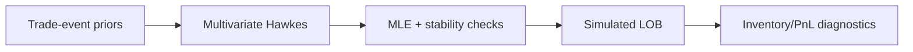

# Architecture

```mermaid
flowchart LR
    N0["Trade-event priors"] --> N1["Multivariate Hawkes"]
    N1["Multivariate Hawkes"] --> N2["MLE + stability checks"]
    N2["MLE + stability checks"] --> N3["Simulated LOB"]
    N3["Simulated LOB"] --> N4["Inventory/PnL diagnostics"]
    N4["Inventory/PnL diagnostics"]
```

## Claim boundary

Real calibration; Hawkes paths and market-making outcomes are simulated.
