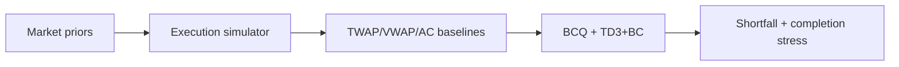

# Architecture

```mermaid
flowchart LR
    N0["Market priors"] --> N1["Execution simulator"]
    N1["Execution simulator"] --> N2["TWAP/VWAP/AC baselines"]
    N2["TWAP/VWAP/AC baselines"] --> N3["BCQ + TD3+BC"]
    N3["BCQ + TD3+BC"] --> N4["Shortfall + completion stress"]
    N4["Shortfall + completion stress"]
```

## Claim boundary

Real calibration; execution environment, fills and shortfall are simulated.
