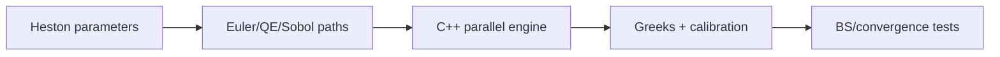

# Architecture

```mermaid
flowchart LR
    N0["Heston parameters"] --> N1["Euler/QE/Sobol paths"]
    N1["Euler/QE/Sobol paths"] --> N2["C++ parallel engine"]
    N2["C++ parallel engine"] --> N3["Greeks + calibration"]
    N3["Greeks + calibration"] --> N4["BS/convergence tests"]
    N4["BS/convergence tests"]
```

## Claim boundary

Numerical validation and local performance benchmark; no live options feed.
